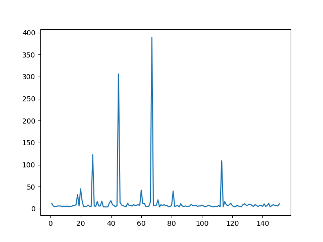
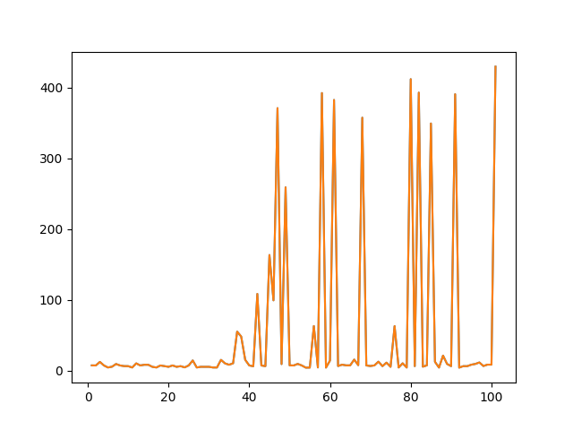

# Deep Q Dino Runner
A DQN designed to beat the google dinosaur game
## Introduction
If you aren't familiar with the Google Chrome dinosaur game,
it is a game that shows up when you aren't connected to the internet
on google chrome. You can play it a version of it here. This project 
uses a Deep Q Network to learn the game. The end goal of this project
is to combine a Convolutional Neural Network with the Q learning algorithm
to have the A.I. play through the browser.

# Model 1:
The first model was a CNN combined with the Q learning algorithm.
It took screenshots of the game using pyautogui, cropped the image 
using PIL and then passed it through the network. 

With this first model I had trouble getting the A.I to learn which 
you can see through the plots below. I suspect this is because of 
the low memory in my computer, unable to handle a larger experience
replay as well as my general understanding of the Q learning algorithm.
In the end, I decided to replicate the game on my computer for now,
passing game information directly as a state. Once the model performs
well on my excellent game, I plan to go back to the original CNN and 
apply my new knowledge and understanding. 

# Model 2:
I decided to first build the game with just the jumping feature (no ducking).
This version of the game still had complexity, as the cacti in the original
game was replaced by blocks with random heights and widths. The speed of the
blocks would also increase proportional to the score. I recreated the model
with an architecture as shown.

Looking at the graph below, you can see the model did perform much better
than the convolutional model with several spikes showing increase in performance.
However, the general trend of the data didn't increase over time, which
showed that it's performance would regress.

There were several issues with the data being fed into the model.
The experience replay was capped at 4000, which meant that over time
the A.I. loses key frames and becomes biased to the last 4000 frames.
Some frames contained useless information such as there being
no obstacles on the screen. 

The next changes I made was increasing the experience replay, normalizing 
the dataset, and removing useless information sent into the model. Applying
these changes made a significant improvement to the data. 

